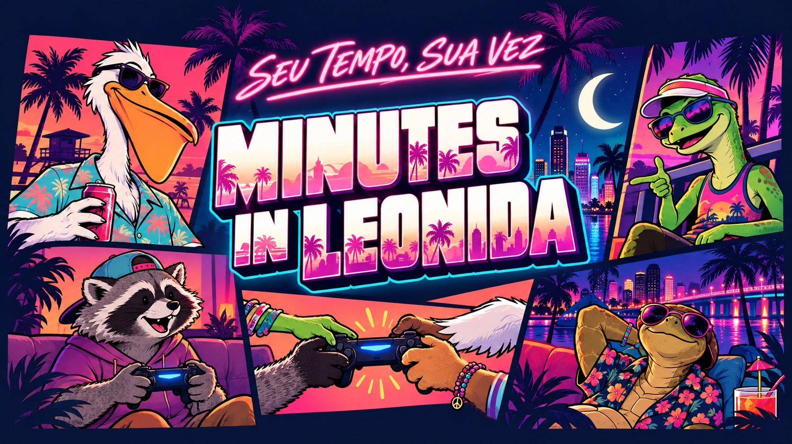

<div align="center">



# MINUTES IN LEONIDA 🎮

### Seu tempo. Sua vez. O cronômetro da jogatina compartilhada.

Uma ferramenta gratuita, feita por fãs, para quem divide um único controle e videogame com a galera e quer revezar os turnos de forma justa e sem discussão.

[](https://kalyelnlaurindo.github.io/minutes-in-leonida/)

<p>
  
  
  
  
  
  
</p>

**Sem cadastro · Sem anúncios · Sem login · Funciona direto no celular e offline**

</div>

---

> 🇺🇸 **English Overview:**  
> **Minutes in Leonida** is a free, fan-made, offline-first web app designed for friends and families who share a single console and controller. It randomizes player turns, tracks playtime with custom alarms, records game-overs (deaths), and computes a complete session scoreboard — 100% private, client-side, with zero registration or cloud servers.


## 💡 O que é o Minutes in Leonida?

Quando a galera se reúne para jogar videogame e só tem **um controle** ou **um console**, sempre rola aquela dúvida: _"Quem joga agora?", "Quanto tempo ele já tá jogando?", "É a minha vez!"_.

O **Minutes in Leonida** foi criado exatamente para resolver isso:

- Sorteia quem começa a partida.
- Marca o tempo exato de cada um no controle com alarme sonoro.
- Registra quando alguém morre no jogo ou quando o tempo acaba.
- Gera um placar final da sessão mostrando quem jogou mais e quem mais perdeu vidas.

Tudo roda direto no navegador do celular, tablet ou computador. Você não precisa criar conta e nem instalar nada da loja de aplicativos — e seus dados nunca saem do seu aparelho.

---

## 🎮 Como usar na sua jogatina (Passo a passo simples)

Você não precisa entender nada de programação para usar. Basta seguir estes passos:

### 📱 1. Abra no seu celular, tablet ou computador

> [!TIP]
> ### 🚀 [CLIQUE AQUI PARA ABRIR O APP: kalyelnlaurindo.github.io/minutes-in-leonida](https://kalyelnlaurindo.github.io/minutes-in-leonida/)
> 
> 📲 **Perfeito para deixar no tablet ou celular apoiado perto do videogame:**
> - **Funciona direto no navegador**, sem precisar de conta, login ou downloads pesados de loja.
> - **Dica de ouro:** Abra no Chrome ou Safari, toque no menu e escolha **"Adicionar à tela de início"** (ou *Instalar aplicativo*). O app vai para a sua tela principal e funciona **100% offline**, mesmo sem Wi-Fi ou sinal de internet!


### 2. Cadastre a galera

- Vá na aba **Jogadores**.
- Digite o nome ou apelido de quem vai jogar.
- Escolha uma cor e um ícone para o avatar de cada um.
- Os jogadores ficam salvos no seu aparelho para as próximas vezes.

### 3. Monte a sessão do dia

- Toque no botão **Montar sessão**.
- Marque quem está presente no sofá hoje.
- Escolha quantos minutos cada turno vai durar (por exemplo: 10 ou 15 minutos).
- Toque em **Sortear ordem** para o app definir quem joga primeiro de forma justa.

### 4. É hora de jogar e passar o controle!

- O jogador da vez pega o controle e você aperta **Iniciar**.
- O cronômetro começa a rodar na tela:
  - ⏸️ **Pausar:** Alguém foi buscar água ou atender a porta? Pause o tempo e retome quando voltar.
  - 🔄 **Passar a vez:** O tempo acabou ou a pessoa concluiu uma missão? Aperte para chamar o próximo da fila.
  - 💀 **Morreu:** Foi pego pela polícia ou bateu o carro no jogo? Registre a morte e o controle vai direto pro próximo jogador!
- Quando o tempo do turno estiver acabando, o app toca um alarme sonoro e vibra o celular para avisar a hora de trocar.

### 5. Placar e zoeira no final

- Quando a jogatina terminar, finalize a sessão.
- O app mostra um resumo completo: tempo total jogado por cada amigo, média por turno e total de mortes.
- Você pode copiar o placar em texto para colar no grupo do WhatsApp ou salvar no bloco de notas.

---

## ✨ Principais recursos para quem joga

- 🎲 **Sorteio automático:** Acabe com as discussões de quem começa ou quem joga depois.
- ⏰ **Alarme na hora da troca:** Toca som e vibra quando o tempo do turno esgota.
- 🎵 **Áudio personalizado:** Você pode escolher qualquer música ou som do seu aparelho para tocar como alarme.
- 📴 **Funciona 100% offline:** Depois de abrir uma vez, funciona mesmo se acabar a internet ou se você estiver na casa de alguém sem Wi-Fi.
- 🔒 **Privacidade total:** Não tem servidor vigiando nada. O histórico e os jogadores ficam salvos apenas na memória do seu navegador.
- 💾 **Backup fácil:** Na aba Ajustes, você pode salvar um arquivo com todos os seus jogadores e histórico, e restaurar em outro celular se quiser.
- 🌐 **Três idiomas:** Português, Inglês e Espanhol.

---

## 💻 Para desenvolvedores: como rodar no seu computador

Se você é programador ou quer modificar o projeto no seu computador:

### Pré-requisitos

- [Node.js 22+](https://nodejs.org/) instalado.
- Terminal / Linha de comando.

### Instalação e execução

```bash
# 1. Clone o repositório
git clone https://github.com/KalyelNLaurindo/minutes-in-leonida.git
cd minutes-in-leonida

# 2. Instale as dependências
npm ci

# 3. Inicie o servidor de desenvolvimento
npm run dev
```

Abra no navegador o endereço exibido (geralmente `http://localhost:5173/`).

> **Usuários Windows:** Você também pode dar dois cliques no atalho [`Abrir-Minutes.vbs`](Abrir-Minutes.vbs) para inicializar o app e abrir automaticamente no navegador.

### Comandos disponíveis

| Comando             | O que faz                                                     |
| ------------------- | ------------------------------------------------------------- |
| `npm run dev`       | Inicia o servidor local de desenvolvimento.                   |
| `npm run build`     | Compila o aplicativo para produção e valida tipos TypeScript. |
| `npm run preview`   | Testa localmente a versão compilada de produção.              |
| `npm run test`      | Roda a suíte de testes unitários com Vitest.                  |
| `npm run lint`      | Verifica a formatação e padrões de código com ESLint.         |
| `npm run typecheck` | Validação estática de tipos do TypeScript sem gerar build.    |

### Estrutura do projeto

```text
.
├── public/                 Ícones, manifesto PWA e áudio do alarme
├── src/
│   ├── app/                Componentes de tela, hooks de estado e PWA
│   ├── components/ui/      Componentes de interface acessíveis (Radix UI)
│   ├── domain/             Regras de negócio de turnos, sorteio, armazenamento e relatórios
│   ├── routes/             Configuração da rota principal do app
│   └── styles.css          Design tokens, Tailwind CSS e estilos globais
├── .github/workflows/      Pipeline de publicação automática no GitHub Pages
└── vite.config.ts          Configuração do Vite, PWA offline e build estático
```

---

## 📄 Licença e Propósito Comunitário

Este projeto é um **trabalho de fã, de código aberto e estritamente sem fins lucrativos**.

Foi desenvolvido com propósito social e comunitário: viabilizar uma ferramenta gratuita que facilite o compartilhamento fraterno de um único videogame e jogo entre amigos, famílias e pessoas que não possuem condições de ter múltiplos consoles.

- 🚫 **Uso Comercial:** É terminantemente proibido qualquer uso comercial, venda, aluguel ou monetização deste software.
- 🛡️ **Isenção de Vínculo:** Este projeto é uma criação independente e não possui filiação, patrocínio ou endosso de distribuidoras de jogos ou fabricantes de consoles. Todas as marcas pertencem aos seus respectivos proprietários.

Para ler todos os termos, consulte o arquivo [**`LICENSE`**](LICENSE).

<div align="center">

---

**MINUTES IN LEONIDA** · _Feito para a galera jogar junto._ 🎮

</div>
